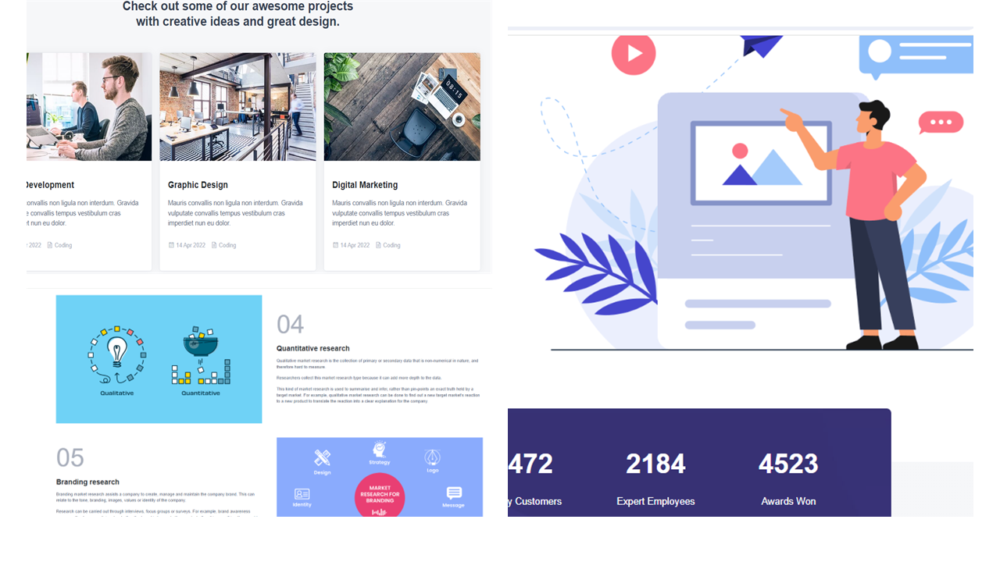

<div align="center">

  <h1 align="center">💠ADEX - Need IT Service?...💠</h1>

  ADEX is fully responsive IT services website, <br /> The website is available in both front-end as well as back-end formats and contain all necessary data

<br>

  <a href="https://www.behance.net/gallery/183287761/Pettie-Case-Study-Webdesign"><strong> 📺 Live</strong></a> 

</div>

<br />

### ☑ Preview



### ☑ Requisites

Before you begin, ensure you have met the following requirements:

* [Git](https://git-scm.com/downloads "Download Git"), [Python](https://www.python.org/downloads/), [Docker](https://www.docker.com/products/docker-desktop/) must be installed on your operating system.

<br>

### ☑ Run 

<br>

🟢 To run **ADEX** with docker-compose, run this command:

<br>

⭐ Move to folder_name:

```bash
cd folder_name
```
⭐ To start project with docker:

```bash
docker-compose up --build
```

<br>

🟢 To run **ADEX** locally, run this command:

<br>

⭐ Move to folder_name:

```bash
cd folder_name
```

⭐ Move to App folder and create new "db" folder:

```bash
cd app && mkdir db 
```

⭐ Switch to local database (sqlite):

To switch to sqlite database, comment the first line below, uncomment the second line. (The given lines are in config.py file)

* <strike> SQLALCHEMY_DATABASE_URI = f'postgresql://{DB_USER}:{DB_PASSWORD}@db/{DB_NAME}' </strike> 
*  SQLALCHEMY_DATABASE_URI = f'sqlite:///{path}/db/main.db'


⭐ Install requirements for the project:

```bash
pip install -r requirements.txt
```

⭐ Migrations to the database:

```bash
cd ..
```
```bash
flask db init
```
```bash
flask db migrate
```
```bash
flask db upgrade
```


⭐ To start/run project :

```bash
python run.py
```

* After executing the command above, you can see website on [localhost:5000](http://localhost:5000/)

<br>

### ☑ Technologies used

<br>

<div align="center">


</div>

<br>

### ☑ Contact

If you want to contact me, you can reach me over [Twitter](https://www.twitter.com/sahil_salahli), [Facebook](https://www.facebook.com/S.Salahli), [Instagram](https://instagram.com/salahli.sahil), [Linkedin](https://www.linkedin.com/in/salahlisahil)

<br>

### ☑ License

This project is licensed by [MIT](https://choosealicense.com/licenses/mit/) and contain respective license information


<br>

### ☑ Creators

The project got prepared by collaborative actions of [Sahil](https://github.com/salahlisahil) , [Aleksey](https://github.com/alexop89056), and [Aisha](https://github.com/AysheUlukhan)

<br>

<div align="center">
  
  
  
  
[](https://twitter.com/sahil_salahli)
  [](https://youtube.com)
  


</div>
